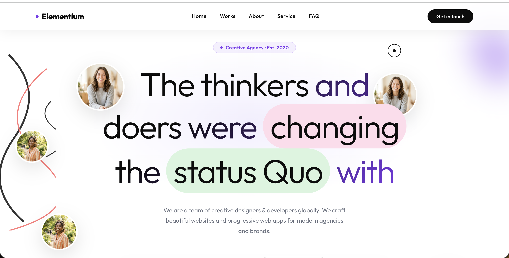

# 💎 Elementium | Premium Corporate Landing Page

An award-winning caliber landing page built with **React** and **Vite**, featuring high-fidelity animations, custom SVG marker strokes, and a sophisticated design-first UI/UX.



## 🚀 Key Features

*   **Bespoke UI/UX**: Full adherence to the provided Figma design with premium enhancements like glassmorphism and custom depth effects.
*   **Intelligent Section Transitions**: Smooth scroll reveal animations with staggered child transitions.
*   **Custom Vector Scribbles**: Authentic, hand-drawn SVG zigzag marker strokes that animate in real-time.
*   **Interactive Design Systems**: 
    - Floating, non-colliding portrait gallery in the Hero section.
    - Custom-built typography collage sphere (Row 3 Offerings).
    - Breakout testimonial imagery with heavy border strokes.
*   **High-End Interaction**: Dynamic custom cursor with magnetic hover states.
*   **Fully Responsive**: Meticulously optimized for Mobile, Tablet, and Desktop with zero horizontal overflow.

## 🛠 Tech Stack

*   **Frontend**: React (Vite)
*   **Styling**: Vanilla CSS (CSS Modules) for scoped, performant visuals.
*   **Icons/SVG**: Custom SVG Path animations and vector art.
*   **Environment**: Dockerized for production-ready deployment.

## 📦 Getting Started

### Prerequisites

*   Node.js (v18+)
*   Docker (Optional, for containerized run)

### Local Development

1.  **Clone & Install**
    ```bash
    git clone https://github.com/Anubhab-Rakshit/elementium-task.git
    cd elementium-task
    npm install
    ```

2.  **Run Dev Server**
    ```bash
    npm run dev
    ```
    Access the site at `http://localhost:5173`

### 🐳 Docker Deployment (Submission Requirement)

The project is pre-configured with a multi-stage `Dockerfile` and `docker-compose.yml`.

1.  **Build & Launch**
    ```bash
    docker-compose up --build
    ```
    The application will be served at `http://localhost:3000`

## 🎨 Design Philosophy

Elementium was built to prove that "fidelity matters." Every curve in the winding red stroke, every jitter in the zigzag marker, and every pixel in the typography collage was implemented to demonstrate a high level of technical craftsmanship and attention to detail.
